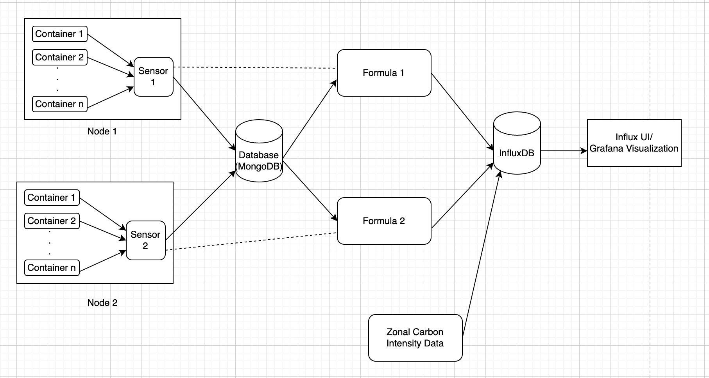

# About

The ContainerAPI is a tool to measure power, energy, and carbon information for local and distributed containers.
It is built on top of the [PowerAPI](https://github.com/powerapi-ng/powerapi) toolkit, but it can also work without it. The goal of the project is to track power, energy and carbon emission metrics of an application, containers and pods. One use case of the ContainerAPI is for users to query their real-time and historical energy usage, and conflate it with their carbon emissions that can later be used to design application policies improving their carbon efficiency.


  

# Setup

There are two ways to install the ContainerAPI. The first one uses the [PowerAPI](https://github.com/powerapi-ng/powerapi) toolkit (detailed below) to measure the power usage of containers. In the second, we use a linear regression function to estimate the power usage of a container.


## PowerAPI set-up:

For PowerAPI set-up, please refer to [PowerAPI installation guide](https://powerapi-ng.github.io/introduction.html). <br> Here we provide an example of installation of the PowerAPI toolkit using docker containers. Here, the Hwpc-sensor publishes data to mongodb. The data in mongodb is read by Smartwatts formula and post data processing by Smartwatts, it publishes the data to influxdb. As running hwpc sensor requires the machine's processor to run on intel chips, we have deployed this on a remote machine having Intel Xeon CPU.

1. Download mongo image, influxdb image, hwpc-sensor image and smartwatts image
2. Create and launch mongo container:
```
docker run -d --name mongodb -p 27017:27017 mongo
```
3. Run auto_hwpc.sh shell script to set the sensor name for hwpc-sensor
4. Use the config file generated by the above shell script to launch hwpc-sensor container:
```
docker run -d --rm --name hwpc-sensor --net=host --privileged --pid=host -v /sys:/sys -v /var/lib/docker/containers:/var/lib/docker/containers:ro -v /tmp/powerapi-sensor-reporting:/reporting -v $(pwd):/srv -v $(pwd)/hwpc_config_file.json:/config_file.json powerapi/hwpc-sensor --config-file /config_file.json
```
5. Create and launch influxdb container:
```
docker run -d --name influxdb -p 8086:8086 influxdb
```
6. Complete influx setup:
```
docker exec -it influxdb influx setup
```
*NOTE: The bucket name used to publish smartwatts data is : 'power_consumption'. Subsequently, the flux queries are using this bucket name to query data. In case, you would want to give any other name to your bucket, please ensure to update the bucket name field in the apprpriate flux queries. Please also match carbon intensity bucket names with the flux queries.* 

7. Extract influx instance's authentication token:
```
docker exec -it influxdb influx auth list
```
8. Run auto_smartwatts.sh shell script to obtain smartwatts config file
9. Update smartwatts config file with the parameters of influxdb set during setup and token
10. Create and launch smartwatts container:
```
docker run -td --name smartwatts-formula --net=host -v $(pwd)/smartwatts_config_file.json:/config_file.json powerapi/smartwatts-formula --config-file /config_file.json
```

## Procfs

PowerAPI is highly dependant on the x86_64 architecture. To overcome that, we extended one of their architecture independant feature, known as Procfs.
When using Procfs, the CPU utilization of the container is used as a proxy for power usage. In order to use this feature, please refer to the [Procfs branch](https://github.com/umassos/carbonfirst-powerapi/tree/feature/procfs/procfs) (still in tests). 

## Script to write Carbon Intensity Data to InfluxDB:
(This script for the current repo is at the location write_carbon_data_to_influxdb.py )

* The write_carbon_data_to_influxdb.py script inside the carbon_intensity folder writes the Carbon Intensity data from specified csv files to InfluxDB.

* The files path is configurable as a parameter under CARBON_DATA -> FILES_PATH in the config.yml (config.yml).

* The script accepts an argument to specify the config file path. This argument is optional and takes a default value of repo config file path is not specified.

* The config file has credentials for Influx as well as the path to the folder containing carbon intensity csv files.

* The script also has optional arguments to send the column names for timestamp, carbon intensity and zone name in the csv files, these default to "timestamp”, “carbon_intensity_avg” and “zone_name” respectively.

* Also, the script accepts 2 modes of writing to Influx, One is simulation and the other realtime. This argument is required to run the script.
  * Simulation - In this mode, the complete carbon intensity data from the csv files provided will be written to influx
  * Realtime - In this mode, the last 3 carbon intensity values from each csv file provided will be written to Influx

* Initially, the script can be run in simulation mode and then onwards a cron job can be set up to write data in realtime. Navigate to the carbon_data folder in the repo and then execute the following command to run the script in simulation mode:
python3 write_carbon_data_to_influxdb.py --write_mode simulation --config_file_path ../config/config.yml

* The Realtime mode helps in periodically writing data to Influx as and when the carbon intensity values are collected.

* The last 3 values are written instead of just 1, to make sure that no data is missed while periodically running in realtime mode.

* A cron job is set up which runs right after the carbon intensity is written(every 30 minutes at 0m and 30m each hour) and with a periodicity of 30 minutes.

* Following is an example to setup a cron job set to run the script in realtime mode

  ```
  crontab -e
  ```

  ```
  15-59/30 * * * * /usr/bin/python3 <path_to_script>/write_carbon_data_to_influxdb.py --write_mode realtime --config_file_path <path_to_repo>/config/config.yml
  ```

  where <path_to_script> is the path where the script is present and <path_to_repo> is the path to the repo which contains config folder with config file
  (This job for the current repo is at the location carbon_data_cron_job ).

## Server and Client set-up:

Configure config.yml file providing host and port number of query_server application. Also update correct influxdb details viz. host and port (where influxdb container is deployed), auth token and org to ensure successful connection of server with influxdb.

## Grafana set-up:

Run the following command to launch a docker container with influx image
```
docker run -d --name=grafana -p 3000:3000 grafana/grafana
```

Similar to InfluxDB setup, since grafana is set up at port 3000 of the host, to be able to view Grafana UI in your local browser at http://localhost:3000/, we’d need to do port forwarding. This can be done with the following command
```
ssh -L 3000:<host_name>:3000 <host_name>
```


# QueryServer and QueryClient:

The query-server can provide data of the following metrics for either a container and an application as a whole:
1. Power
2. Energy
3. Carbon intensity
4. Carbon emission

There are essentially 2 types of metrics - point and cumulative metrics. <br> Point metrics are metrics which can have value at given timestamp, while cumulative metric can only have value in time range. 

In CarbonFirst, power and carbon intensity are point metric, while energy and carbon emission are cumulative metrics.

## Decoding query_client request to query_server:
Client sends request in json format as key and value pair. All values are in string format. 'start_time' and 'end_time' expect timestamps in Zulu time (UTC) format. 
1. Power: 
```
{ 
  'start_time':  
  , 'end_time':
  , 'entity':
  , 'metric': 'power'
  , 'sensor':
  , 'target':
}
```

Example: 

```
{
  'start_time': '2022-12-12T07:39:00.000Z' , 
  'end_time': '2022-12-12T07:40:00.000Z', 
  'entity': 'container', 
  'metric': 'power', 
  'sensor': 'obelix94', 
  'target': 'rapl'
}
```
Once the json template is ready, use /power_consumption server endpoint to channel client request correctly to the server. For example, '{server_url}/power_consumption' and attach the json request in the POST request to server.

*If power per application is needed then replace 'entity' key's value as 'application'.*

*If power at a specific timestamp is required, then provide the same timestamp in 'start_time' and 'end_time' keys.*

2. Energy:

```
{ 
  'start_time':  
  , 'end_time':
  , 'entity':
  , 'metric': 'energy'
  , 'sensor':
  , 'target':
}
```

Example: 

```
{
  'start_time': '2022-12-12T07:39:00.000Z' , 
  'end_time': '2022-12-12T07:40:00.000Z', 
  'entity': 'container', 
  'metric': 'energy', 
  'sensor': 'obelix96', 
  'target': 'mongodb'
}
```
Once the json template is ready, use /power_consumption server endpoint to channel client request correctly to the server. For example, '{server_url}/power_consumption' and attach the json request in the POST request to server.

*If energy per application is needed then replace 'entity' key's value as 'application'.*

3. Carbon Intensity:

```
{ 
  'start_time':  
  , 'end_time':
  , 'zone':
  , 'metric': 'carbon_intensity'
}
```

Example: 

```
{
  'start_time': '2022-12-12T07:39:00.000Z' , 
  'end_time': '2022-12-12T07:40:00.000Z', 
  'zone': 'US-NY-NYIS', 
  'metric': 'carbon_intensity', 
}
```
Once the json template is ready, use /carbon_intensity server endpoint to channel client request correctly to the server. For example, '{server_url}/carbon_intensity' and attach the json request in the POST request to server.

*If carbon intensity at a specific timestamp is required, then provide the same timestamp in 'start_time' and 'end_time' keys.*

4. Carbon Emission:

```
{ 
  'start_time':  
  , 'end_time':
  , 'entity':
  , 'metric': 'carbon_emission'
  , 'sensor':
  , 'target':
}
```

Example: 

```
{
  'start_time': '2022-12-12T07:39:00.000Z', 
  'end_time': '2022-12-12T07:40:00.000Z', 
  'entity': 'container', 
  'metric': 'carbon_emission', 
  'sensor': 'obelix96', 
  'target': 'global'
}
```
Once the json template is ready, use /carbon_emission server endpoint to channel client request correctly to the server. For example, '{server_url}/carbon_emission' and attach the json request in the POST request to server.

*If carbon emission per application is needed then replace 'entity' key's value as 'application'.*

## Undestanding query_server response:

The Server sends response in json format as key and value pair. 
<br> A typical query_server response contains the following fields for power, energy and carbon emission queries:

```
{
  'metric':
  , 'entity':
  , 'start time':
  , 'end time':
  , 'sensor':
  , 'target':
  , 'unit':
  , 'data':
}
```
Examples: 

``` 
{'metric': 'power', 'entity': 'container', 'start time': '2022-12-20T07:39:00.000Z', 'end time': '2022-12-20T07:40:00.000Z', 'sensor': 'obelix94', 'target': 'rapl', 'unit': 'W', 'data': [19.674072265625, 19.80129665798611, 19.664171006944443, 19.543592664930554, 20.00359429253472, 19.873860677083332, 19.510904947916668, 20.01430935329861, 19.442613389756943, 20.1806640625, 20.073038736979168, 20.098673502604168, 20.043131510416668, 20.037367078993054, 19.968058268229168, 20.191446940104168, 19.266221788194443, 20.09006076388889, 20.233289930555554, 20.23037380642361, 20.099690755208332, 20.011461046006943, 20.38174099392361, 19.80556911892361, 20.08673773871528, 20.111083984375, 20.507066514756943, 20.253499348958332, 19.729478624131943, 20.338134765625, 19.955308702256943, 20.2252197265625, 19.96310763888889, 19.72751193576389, 20.15774197048611, 20.11447482638889, 20.14743381076389, 19.889119466145832, 19.73870171440972, 20.52680121527778, 20.18073187934028, 19.601643880208332, 20.12688530815972, 19.99579535590278, 19.591539171006943, 19.55986870659722, 19.870808919270832, 20.02387152777778, 19.77871365017361, 20.118408203125, 19.90044487847222, 20.01858181423611, 19.52907986111111, 20.387437608506943, 19.889933268229168, 19.927978515625, 20.229899088541668, 19.77145724826389, 20.29018825954861]} 
```

``` 
{'metric': 'carbon emission', 'entity': 'application', 'start time': '2022-12-20T22:19:41.000Z', 'end time': '2022-12-20T22:29:11.000Z', 'sensor': 'obelix93', 'target': 'hwpc-sensor', 'unit': 'gCO2', 'value': 0.6640141305097341} 
```

<br> A typical query_server response contains the following fields for carbon intensity queries:
```
{
  'metric':
  , 'start time': 
  , 'end time':
  , 'zone':
  , 'unit':
  , 'data':
}
```
Example:

``` 
{'metric': 'carbon intensity', 'start time': '2022-12-11T18:32:00.000Z', 'end time': '2022-12-11T20:32:00.000Z', 'zone': 'US-NY-NYIS', 'unit': 'gCO2eq/kWh', 'data': [279, 282, 277, 284]} 
```

# Steps to connect Grafana to InfluxDB and visualize data from InfluxDB in Grafana:

* Once port forwarding to the host in which Grafana is deployed is done as mentioned in Grafana setup, Grafana Ui can be accessed at  http://localhost:3000/
* This webpage navigates to the login page of Grafana. The default username and password to login to Grafana are admin and admin respectively.
* Once logged in the password can be changed in case needed.
* First step is to configure a Data Source of Type InfluxDB
  This can be done by following the below steps

  Click on the “Add your first data source” in the main homepage as seen below:

  

  Then, select the type as “InfluxDB” under the Time Series Databases and add the configurations for Influx as shown below

  
  

  Once the parameters are added, click on the “Save & test” button to test if Influx is connected. If it's unsuccessful, double check and add parameters correctly.

* Once the data source is setup, click on the Dashboards button on the left side pane and create New Dashboard -> Add New Panel

* In the Panel, select Data Source as the InfluxDB data source that we’ve configured before, and write the corresponding Flux Query to see the output in the Panel. The time range can be modified in the top right options and changes can be saved by clicking on Save button on top right.
* The refresh button can be set to update every 5s, 10s, etc as needed from the Dashboard’s view in the top right, just beside refresh button as shown in the below screenshot

  

* The above dashboard has 3 such Panels setup, one for carbon emission, one for Power consumption per application and one for Power consumption per container
